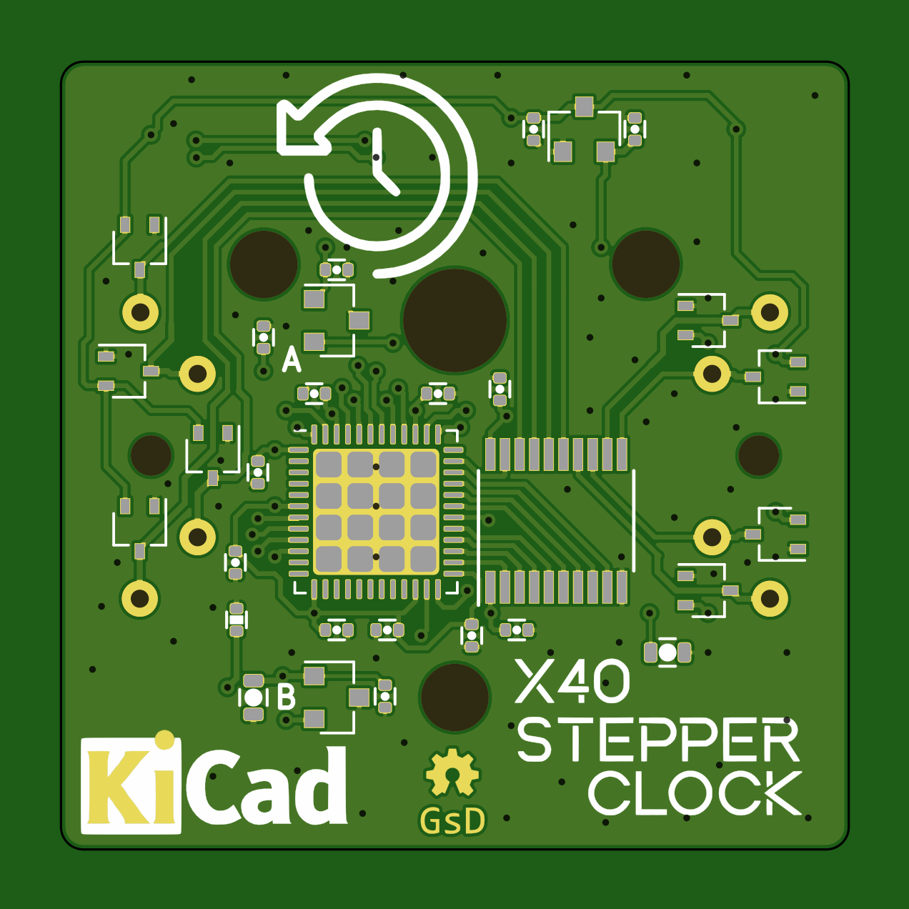
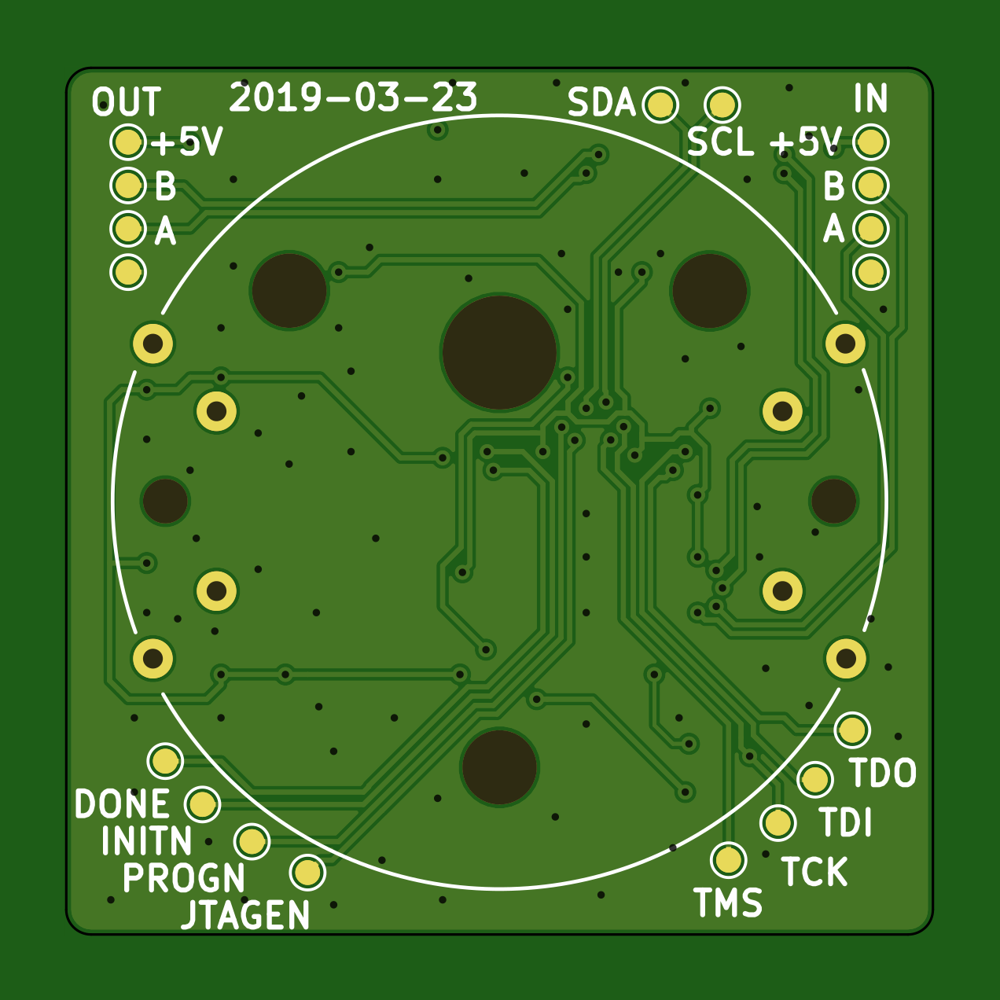
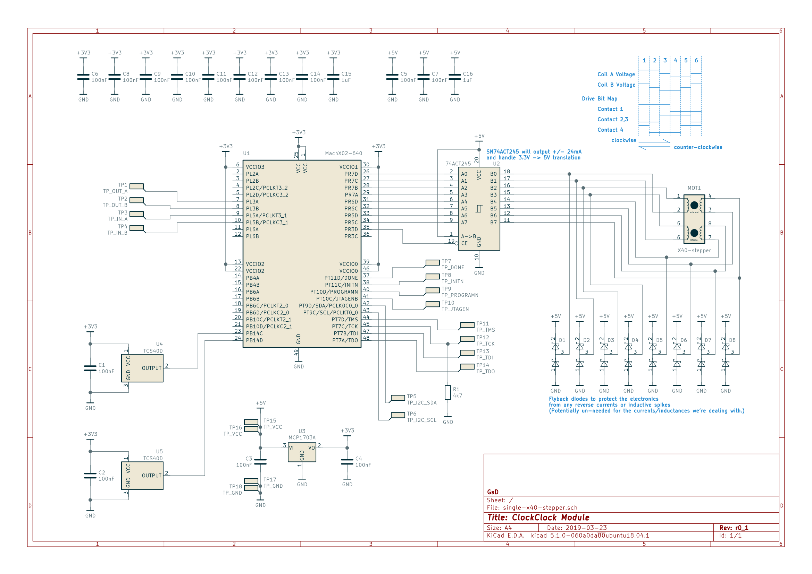

# ClockClock

## Experiements with stepper based instrument dials to create a digitally controlled Analoge Clock.

## Hardware

* MachXo2-640 in QFN48
* Plenty of test pads
* X40 Dual output instument dial stepper (modified for full rotation)
* Hall effect switches for indexing arms on clock
* Flyback diodes on all motor outputs

## Board View

## Schematic

